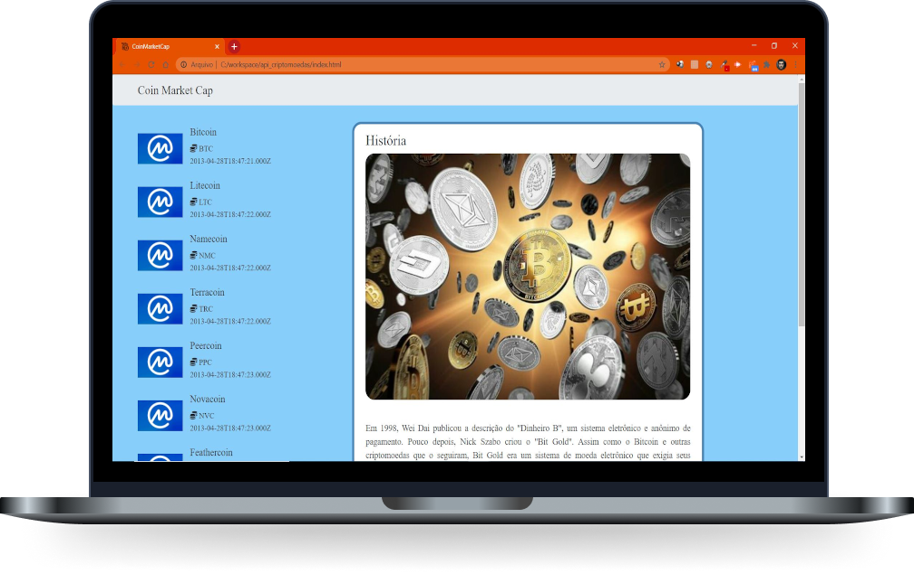

# :moneybag:  API CRIPTOMOEDAS (Coin Market Cap)

## 🚀 Tecnologias

Esse projeto foi desenvolvido com as seguintes tecnologias:

- [HTML](https://developer.mozilla.org/pt-BR/docs/Web/HTML)
- [CSS](https://developer.mozilla.org/pt-BR/docs/Web/CSS)
- [JavaScript](https://developer.mozilla.org/pt-BR/docs/Web/JavaScript)
- [Bootstrap](https://getbootstrap.com/)

## 💻 Projeto

Projeto utilizando API de Criptomoeda (Coin Market Cap) com JavaScript. Manipulação da API e exibição das informações em uma página web promovido pela DIO.

[Portal do desenvolvedor](https://pro.coinmarketcap.com/account)  
[Documetação de autenticação](https://coinmarketcap.com/api/documentation/v1/#section/Authentication)  
[Documentação API](https://coinmarketcap.com/api/documentation/v1/#)  
